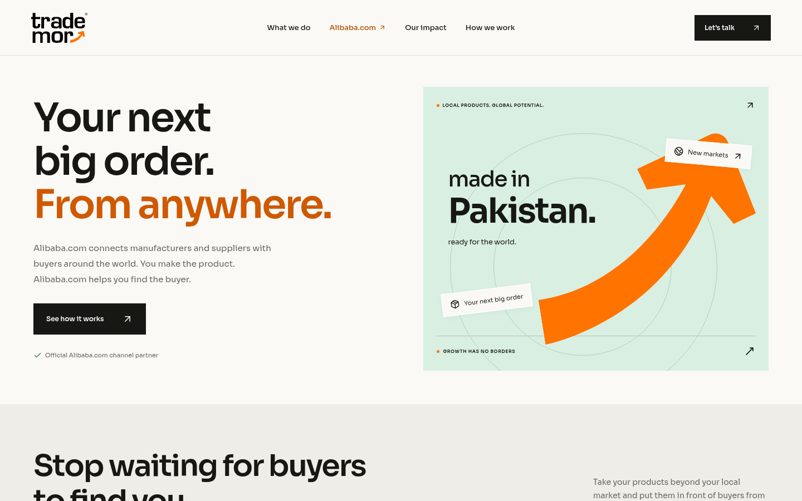

# Trademor website

Responsive Home (`/`) and Alibaba.com (`/alibaba`) pages built from the supplied website copy and Trademor brand guide. React, Vite, Express, self-hosted Sora, and original Illustrator logos exported as SVG.

## Run

Use Node.js 24 and npm 11 (the validated environment versions).

```sh
cd /workspace/Trademor-website-
npm ci --cache /workspace/.npm-cache --no-audit --no-fund
npm run dev
```

The application and enquiry API run together on port 3000. Override with `PORT`. Health check: `curl --fail http://127.0.0.1:3000/api/health`.

```sh
npm run build
npm test
npm start
```

`npm start` serves the production build and the same API. Building does not start a server. No external services or secret credentials are required.

## Enquiries

The three-step form sends requests to `POST /api/enquiries`. The backend validates all fields, limits repeated requests, checks browser request origins, and saves accepted requests to `.data/enquiries.jsonl`. The response contains a unique reference only after the request is saved. No inbox or CRM delivery has been configured.

Set `ENQUIRY_DATA_DIR` to a persistent writable directory when deploying. Keep this directory private, outside `dist`, and back it up. The JSONL store and in-memory rate limiter are intended for a single Node process; use a shared database and shared rate limiter if scaling across instances. Serve through HTTPS in production. There is deliberately no public endpoint exposing enquiries. Do not commit or publish enquiry records.

## Netlify deployment

`netlify.toml` publishes `dist`, runs `npm run build:netlify`, and rewrites `/alibaba` to the SPA entry point. Netlify hosts the static site; it does not run `server.js`.

The Netlify build sets `VITE_ENQUIRY_PROVIDER=netlify` and sends enquiries to Netlify Forms. The static form declaration in `index.html` lets Netlify discover every field, including the selected plan and request reference. Enable form detection in the Netlify site's Forms settings before deploying if it is disabled. Enquiries will be visible in the site's Netlify Forms dashboard; optional inbox notifications can be configured there. This is separate from the local Express/JSONL workflow.

For a Git-connected site, import this repository in Netlify, select `main`, and let `netlify.toml` supply the build settings. Alternatively, with Netlify CLI authentication:

```sh
npm run build:netlify
netlify deploy --prod --dir=dist --no-build
```

Link or create the intended site first. `NETLIFY_AUTH_TOKEN` authenticates CLI/API deployment and `NETLIFY_SITE_ID` can select an existing site. Keep these credentials out of Git. A deployment is complete only after its public URL, both routes, brand assets and a real form submission have been verified.

## Design previews




The full desktop/mobile designs are also in [docs/Trademor-Design.pdf](docs/Trademor-Design.pdf).

## Browser validation

```sh
npm run smoke
```

The smoke test requires Chromium (`/usr/bin/chromium` in this cloud environment; override with `CHROMIUM_PATH`). It launches a temporary production server, checks both pages at desktop/mobile widths, tests navigation, plan comparison and readiness controls, and completes the enquiry form against a temporary data directory. Screenshots are stored outside the repository under `/tmp/trademor-review/render`. Tests leave no sample leads in the site's data store.

## Design and source material

The supplied Home and Alibaba.com PDFs are the content source. Brand colors and Sora come from the supplied guide. The main logos and growth arrow in `public/brand` derive from the supplied Illustrator file; the favicon is an authored brand-inspired mark. Partnership names are typeset text, not replacement partner logos. Statistics and plan prices come from the supplied copy; subscription terms, package features, taxes, testimonials and case-study results are not invented.

Impeccable guidance was accessed from its official `pbakaus/impeccable` repository because the supplied website URL was blocked by the cloud network policy. Its context launcher, design detector, and responsive/accessibility guidance were used during refinement. Mobbin's plugin tools were unavailable in the session; no Mobbin research is claimed.

Development processes need to be restarted in a new cloud task. Deployment status is reported separately; configuration files alone do not establish that a site is live.
